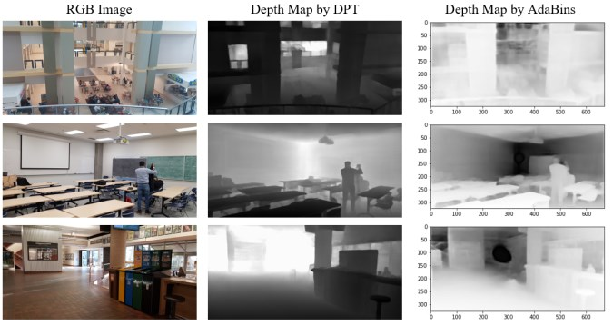

# ECE 740: Computer Vision in Robotics - Monocular Depth Estimation 

This repository contains the coursework and project for the graduate-level course **"ECE 740: Computer Vision in Robotics"** at the **University of Alberta**. The project focused on **Monocular Depth Estimation (MDE) from a single RGB image**, using deep learning techniques to predict depth maps without additional sensors.

---

## Project Overview

Depth estimation is a crucial task in computer vision with applications in **autonomous vehicles, 3D reconstruction, and augmented reality**. The goal of this project was to explore different **deep learning-based monocular depth estimation techniques**, including:

- **Baseline Model:** A simple U-Net architecture for depth estimation.
- **Advanced Methods:** Transfer learning and transformers for improved depth prediction.
- **Datasets:** Evaluation on well-known datasets such as KITTI, NYU Depth, and DIODE.

---

## Methodology

The project was conducted in several phases:

1. **Literature Review:**  
   - Understanding the fundamentals of **monocular vs. stereo depth estimation**.
   - Exploring deep learning models used for depth estimation.

2. **Baseline Model:**  
   - Implemented a basic **U-Net architecture** with depth loss functions such as SSIM and L1 loss.
   - Trained on the **DIODE dataset**, using indoor RGB and depth image pairs.

3. **Improved Models:**  
   - **Transfer Learning:** Leveraging pre-trained DenseNet-169 on the ImageNet dataset for better feature extraction.
   - **Transformers:** Utilizing vision transformers for feature encoding and improved accuracy.

4. **Experimental Evaluation:**  
   - Depth estimation performance evaluation using standard metrics:
     - Root Mean Squared Error (RMSE)
     - Structural Similarity Index (SSIM)
     - Average Relative Error
     - Threshold Accuracy

---

## Datasets Used

We used several popular datasets for training and evaluating our models:

- **[KITTI Dataset](http://www.cvlibs.net/datasets/kitti/):** Outdoor driving scenes with LiDAR-based ground truth.
- **[NYU Depth V2](https://cs.nyu.edu/~silberman/datasets/nyu_depth_v2.html):** Indoor RGB-D dataset with densely annotated depth images.
- **[DIODE Dataset](http://diode-dataset.org/):** A diverse indoor/outdoor dataset with high-quality depth annotations.
- **Make3D Dataset:** Outdoor monocular RGB-depth pairs.

## Results
Our experiments showed significant improvements with advanced deep learning methods:

- The baseline U-Net model struggled with edge definitions and performed poorly in texture-less regions.
- Transfer learning improved object boundary detection and overall accuracy.
- Vision transformers provided state-of-the-art performance, especially for large-scale datasets.

**Sample Depth Estimation Results:**

  

## Project Contributors
- Mahdi Chalaki – Algorithm implementation, report writing, and presentation.
- Masoud Jafaripour – Literature review, dataset analysis, and report writing.
